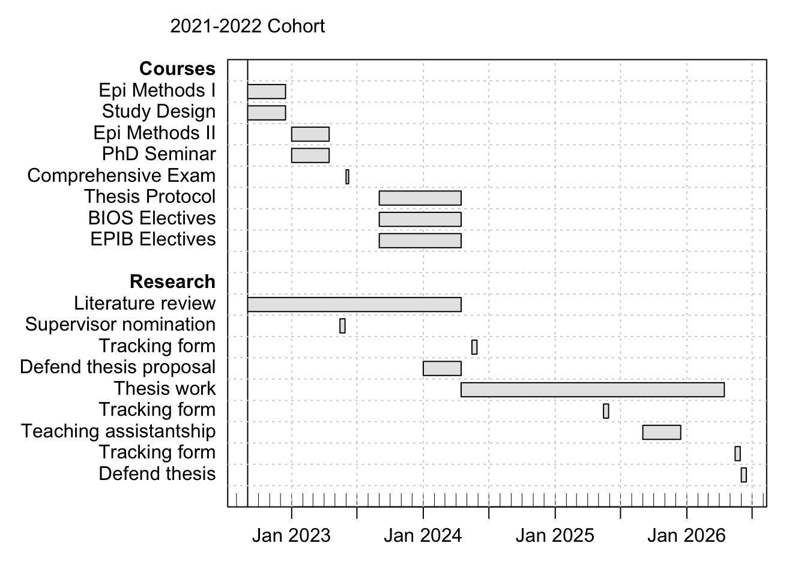

# Introduction

Welcome to the the PhD program in Epidemiology at McGill. This handbook aims to provide an overview of important requirements for completing your degree, as well as providing links to other sources of information to enhance your experience in the program.

Epidemiology is the study and analysis of the patterns and causes of disease in human populations. It forms the core discipline of public health by identifying the distribution and determinants of health and disease, and by gaining the etiologic understanding to intervene toward the improvement of population health. The PhD program in epidemiology at McGill trains scientists and health professionals to design and conduct studies, analyze health data and effectively communicate scientific results, and to gain novel insights into the causes and prevention of diseases at the population level. Epidemiologic work at the doctoral level involves a thorough integration of biological knowledge of pathogenesis, statistical knowledge of quantitative analysis and causal inference, and sociological knowledge to place these insights in the context of dynamic and interconnected human populations. Major areas of strength at McGill include epidemiologic methods, clinical epidemiology, infectious diseases, social epidemiology, pharmacoepidemiology, public and population health, global health, environmental epidemiology, chronic diseases and aging, and perinatal epidemiology.

## PhD Program Leadership

*Program Director*    
Sam Harper (sam.harper@mcgill.ca)  
Phone: 514-398-2356  
Office: 2001 McGill College, Suite 1262  

*Program Advisor*  
Kris Filion (kristian.filion@mcgill.ca)  
Phone: 514-340-8222 x 28394  
Office: Centre for Clinical Epidemiology, Jewish General Hospital – Lady Davis Institute  

*Student Affairs Officer*  
André Yves Gagnon (gradadmin.eboh@mcgill.ca)  
Phone: 514-398-1812  
Office: 2001 McGill College, Suite 1253  

*Administrative Student Affairs Coordinator*  
Katherine Hayden (gradcoord2.eboh@mcgill.ca)    
Phone: 514-398-6269  
Office: 2001 McGill College, Suite 1250

*PhD Student Representative*  
Leah Flatman (leah.flatman@mail.mcgill.ca)  

## Competencies
Our program aims to prepare our students for successful careers in epidemiology. Upon successful completion of the PhD in Epidemiology at McGill, we aim for our students to: 

- Understand the difference between descriptive, predictive, and etiologic epidemiologic studies, and the value of different study designs for epidemiologic science;
- Develop a thorough understanding of modern epidemiologic methods and how they are utilized in the service of answering epidemiologic questions;
- Apply quantitative skills to the analysis of epidemiologic data using statistical software;
- Systematically and critically review the epidemiologic literature, synthesize existing evidence, and identify important gaps in knowledge;
- Design, write, and critique an independent research proposal for answering epidemiologic questions;
- Develop skills in communicating epidemiologic findings to a variety of audiences (professional, student, lay) and through a variety of formats, including oral and written reports.

## High-Level Program Overview
Successful completion of the PhD program in EBOH involves 4 key milestones:  
- Required coursework;  
- Passing a comprehensive exam;  
- Developing and defending a thesis protocol; and  
- Writing and defending the doctoral thesis.  

The timeline for program completion varies depending on each student's circumstances and subject matter, but most of our students complete the PhD in around 5 years. 

## Example Timeline and Milestones
Below we show a very general example of a timeline for completing all of the required coursework and other milestones, as well as some reporting requirements. 

